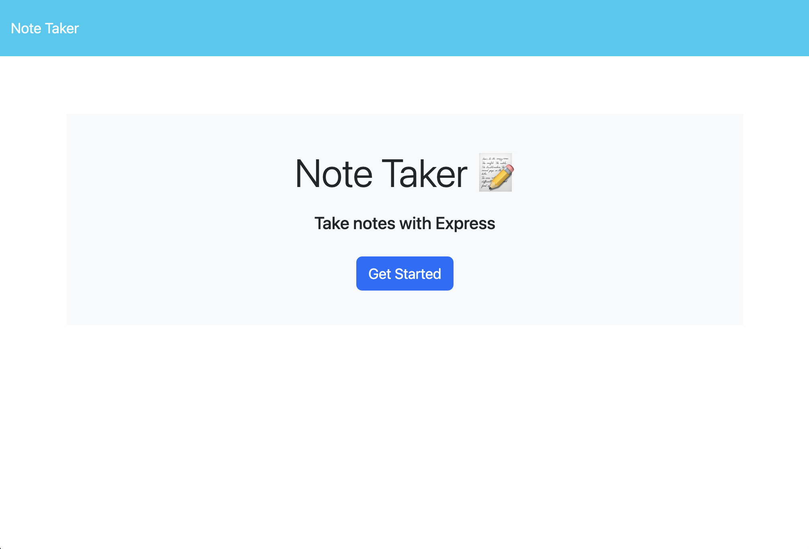

# Note Taker

## Description
A simple note-taking app with a locally hosted JSON file serving as the database.
## Table of Contents
- [Installation](#installation)
- [Usage](#usage)
- [Screenshot](#screenshot)
- [License](#license)
- [Contributors](#Contributors)
- [Tests](#tests)
- [Questions](#questions)
## Installation
This application uses the NodeJS environment. Firstly make sure to have this set up on your local workstation or remote server.  
1. Clone the repo
2. Navigate to the folder via Terminal/Command-Line
3. Run the commands "npm i" and "node server"
4. Go to your browser and load the webpage.

The link should be provided in your console.
## Usage
To use the app, press get started. Fill out the title and text and press the save button.  
The application is deployed live [on Render](https://github.com/@alvin-est).
## Screenshot

## License
      This project is licensed under the MIT license.
## Contributors
- [@alvin-est](https://github.com/@alvin-est)
- The Coding Bootcamp at USYD [(source repo)](https://github.com/coding-boot-camp/miniature-eureka)
## Tests
None used.
## Questions
If you have any questions, please contact me at [contact@alvin-the.dev](mailto:contact@alvin-the.dev). You can also find me on GitHub at [@alvin-est](https://github.com/@alvin-est).  